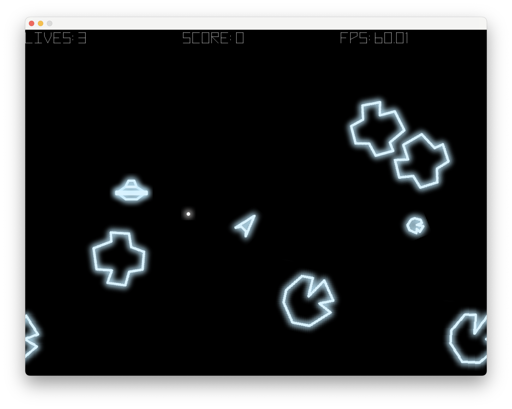

# Asteroids

A modern implementation (in [Golang](https://go.dev/)) of the classic arcade game.



The game can be compiled natively and run locally, or cross-compiled into [WASM](https://webassembly.org/) and
deployed to GitHub Pages. Every time a commit is made on the main branch, a GitHub action deploys a fresh version.

## Running in a browser

You can play the game online at https://www.destructuring-bind.org/asteroids. A browser with WebGL support is required.
It will run on smartphones and iPads, however there is no support yet for non-keyboard input.

## Running locally

Install the `go` binary (instructions [here](https://go.dev/doc/install)), and:

```
go run github.com/rm-hull/asteroids@latest
```

## Keyboard Controls

<kbd>LEFT-SHIFT</kbd> or <kbd>SPACE</kbd> : Fire

<kbd>←</kbd> or <kbd>→</kbd> : Rotate left & right

<kbd>↑</kbd> : Thrust

<kbd>F</kbd> : Toggle fullscreen

<kbd>P</kbd> : Toggle pause

<kbd>Q</kbd> : Quit

<kbd>R</kbd> : Restart

## Strategy

Pick off the asteroids taking care to mop up exploded fragments. After a while an alien saucer may appear, and will
start aiming at you. As you progress through the levels, the asteroid belt gets more dense, and the alien's
shooting accuracy improves. On starting each level, you will have a few seconds of immunity to get yourself out of
danger.

There is a "god-mode" which gives you immortality and your weapon is hugely upgraded from the normal salvo of 3 shots.
You'll have to browse the source code to find out how to activate it.

## TODO

- Hyperspace
- ~~Extra lives at every 10,000~~
- (Persistent) High score
- Score wraps round at 100,000 (like the original)
- Support different sprite sheets
- Code refactoring / reorganisation / tests
- Custom key mapppings
- Touchscreen support

## KNOWN ISSUES

- Fix sound distortion

## References & Attribution

- https://www.classicgaming.cc/classics/asteroids/play-guide
- https://arcadeblogger.com/2018/10/24/atari-asteroids-creating-a-vector-arcade-classic/
- https://mixkit.co/free-sound-effects/arcade/
- https://threedots.tech/post/making-games-in-go/
- https://news.ycombinator.com/item?id=38403111
- https://github.com/sedyh/awesome-ebitengine
- https://fontstruct.com/fontstructions/download/1534627
- https://opengameart.org/content/asteroids-vector-style-sprites
